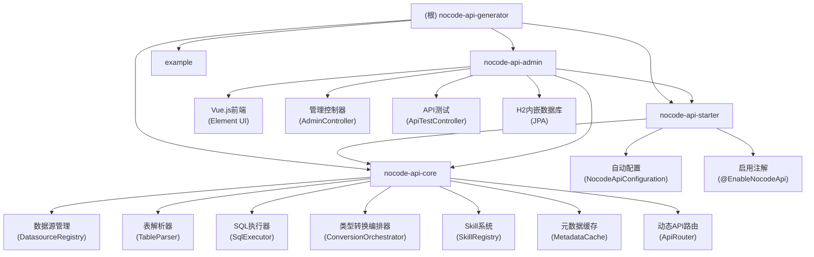

# NoCode API Generator

## 项目愿景

NoCode API Generator 是一个 Maven 多模块 Java 项目，旨在自动根据数据源表生成 RESTful API 接口，实现零代码快速开发。通过简单的配置，即可将任意数据库表暴露为标准的 CRUD API。

## 架构总览



## 模块索引

| 模块路径 | 职责 | 入口文件 | 测试目录 | 配置文件 |
|---------|------|---------|---------|---------|
| `nocode-api-core` | 核心业务逻辑：数据源管理、表解析、API生成、类型转换编排 | `ApiRouter.java` | 缺失 | `pom.xml` |
| `nocode-api-starter` | Spring Boot Starter：自动配置、启用注解 | `EnableNocodeApi.java` | 缺失 | `pom.xml` |
| `nocode-api-admin` | Web管理界面：数据源配置、API文档、在线测试 | `NocodeApiAdminApplication.java` | 缺失 | `application.yml` |
| `example` | 示例项目：演示如何使用 nocode-api-starter | `ExampleApplication.java` | 缺失 | `pom.xml` |

## 技术栈

- **Java**: 1.8
- **Spring Boot**: 2.7.18
- **数据库**: MySQL, PostgreSQL, Oracle, SQL Server
- **数据源**: Druid 1.2.20
- **ORM**: MyBatis + JPA
- **前端**: Vue.js 2.7 + Element UI 2.15 + Vite 5
- **API文档**: Knife4j 3.0.3
- **图形**: AntV G6 4.8

## 运行与开发

### 编译构建

```bash
# 全量编译
mvn clean package

# 独立运行 Admin（包含可执行 JAR）
mvn clean package -Pstandalone
```

### 启动方式

**方式一：独立运行 Admin 模块**
```bash
java -jar nocode-api-admin/target/nocode-api-admin-1.0.0.jar
# 访问 http://localhost:8080/nocode-admin
```

**方式二：集成到其他 Spring Boot 项目**
```java
@EnableNocodeApi(enableAdmin = true)
@SpringBootApplication
public class MyApplication {
    public static void main(String[] args) {
        SpringApplication.run(MyApplication.class, args);
    }
}
```

### 前端开发

```bash
cd nocode-api-admin/src/main/frontend
npm install --legacy-peer-deps
npm run dev  # 开发服务器 localhost:3000
npm run build  # 生产构建
```

## API 接口

### 动态 API（由 ApiRouter 提供）

基础路径：`/api/{datasource}/{table}`

| 方法 | 路径 | 描述 |
|------|------|------|
| GET | `/api/{datasource}/{table}` | 查询列表（分页+过滤） |
| GET | `/api/{datasource}/{table}/{id}` | 查询单条记录 |
| POST | `/api/{datasource}/{table}` | 新增记录 |
| PUT | `/api/{datasource}/{table}/{id}` | 更新记录 |
| DELETE | `/api/{datasource}/{table}/{id}` | 删除单条 |
| DELETE | `/api/{datasource}/{table}` | 批量删除 |
| POST | `/api/{datasource}/{table}/batch` | 批量新增 |
| POST | `/api/{datasource}/{table}/query` | 自定义查询 |
| GET | `/api/{datasource}/{table}/schema` | 获取表结构 |
| GET | `/api/{datasource}/tables` | 获取所有表 |
| GET | `/api/datasources` | 获取所有数据源 |
| GET | `/api/health` | 健康检查 |

### 管理 API（由 AdminController 提供）

基础路径：`/api/admin`

| 方法 | 路径 | 描述 |
|------|------|------|
| GET | `/api/admin/system/info` | 系统信息 |
| GET | `/api/admin/datasources` | 获取数据源列表 |
| POST | `/api/admin/datasources` | 添加数据源 |
| DELETE | `/api/admin/datasources/{name}` | 删除数据源 |
| GET | `/api/admin/datasources/{name}/tables` | 获取表列表 |
| GET | `/api/admin/datasources/{name}/schemas` | 获取模式列表 |
| GET | `/api/admin/datasources/{name}/tables/{table}` | 获取表结构 |
| POST | `/api/admin/datasources/{name}/execute` | 执行SQL |
| GET | `/api/admin/datasources/{name}/api-doc` | 生成API文档 |
| GET | `/api/admin/datasources/{name}/er-diagram` | 获取ER图数据 |
| POST | `/api/admin/datasources/{name}/diagram-layout` | 保存ER图布局 |

## 配置示例

```yaml
nocode:
  api:
    enabled: true
    admin:
      enabled: true
      path: /nocode-admin
    datasources:
      - name: postgres_primary
        jdbc-url: jdbc:postgresql://127.0.0.1:5432/mydb
        username: postgres
        password: postgres
        initialSize: 5
        minIdle: 5
        maxActive: 20
    defaultPageSize: 10
    maxPageSize: 1000
```

## 变更记录 (Changelog)

### 2026-03-24 - 初始文档生成

- 完成项目架构分析
- 生成根级 CLAUDE.md
- 生成模块级 CLAUDE.md（nocode-api-core, nocode-api-starter, nocode-api-admin, example）
- 建立模块结构图（Mermaid）
